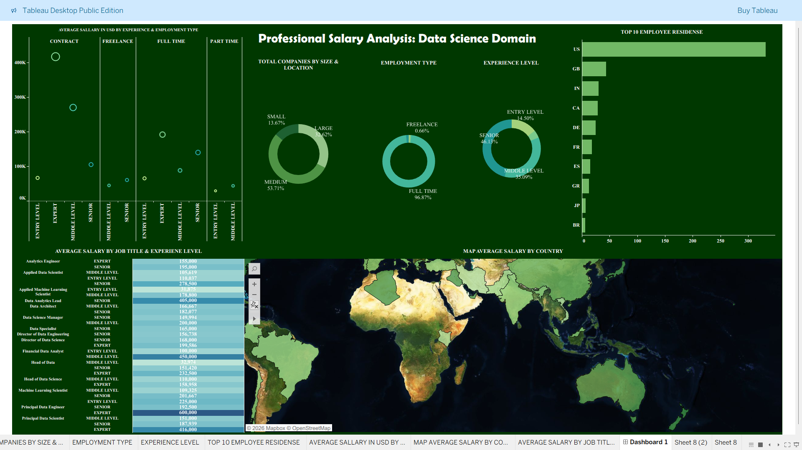

# Professional Salary Analysis – Data Science Domain (Tableau)

## 📌 Project Overview
This project presents a comprehensive salary analysis within the data science domain using Tableau.  
The dashboard explores how salaries vary by experience level, employment type, job role, company size, and geographic location.

This project is designed as part of a professional data analytics portfolio.

---

## 📊 Dashboard Insights
- Average salary by experience level and employment type
- Salary comparison across job roles
- Company size distribution
- Employment type distribution
- Global average salary by country
- Top employee residence countries

---

## 🛠 Tools & Technologies
- Tableau Public / Tableau Desktop
- CSV dataset
- GitHub for project versioning

---

## 📁 Dataset
- Dataset: `ds_salaries.csv`
- Domain: Data Science & Analytics
- Includes salary, experience level, job title, company size, and location

---

## 📷 Dashboard Preview

---

## 🔗 Tableau Public Dashboard
https://public.tableau.com/app/profile/abrar.ahamed7210/viz/ProfessionalSalaryAnalysisDataScienceDomainANALYSISFINALOUTPUTEXPORTPACAGE/Dashboard1?publish=yes)

---

## 👤 Author
**Abrar Ahmed**  
Aspiring Data Analyst | Tableau | Power BI | SQL | Python  

---

## 📌 Note
This project is created for learning and portfolio purposes.  
All data used is publicly available.
